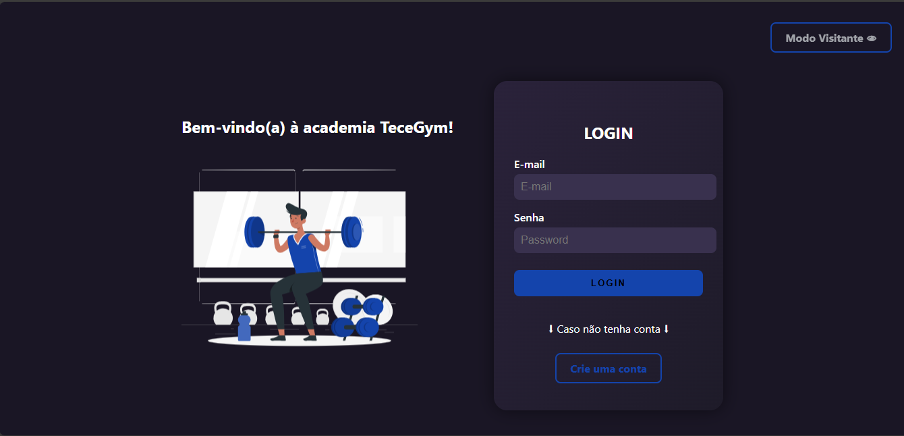

# TeceGym - Site da Academia

TeceGym é uma plataforma online para gerenciar e exibir planos de treino, com recursos de cadastro de usuários e autenticação. O site oferece uma interface moderna e intuitiva, com foco em facilitar a jornada dos usuários na academia.

## Funcionalidades

- Cadastro e login de usuários
- Página inicial com acesso aos planos de treino, dietas e muito mais
- Exibição de grupos musculares com exercícios para cada grupo
- Modo visitante para visualização limitada sem login

## Tecnologias Usadas

- **Frontend:** HTML, CSS (com animações SVG/GIF)
- **Backend:** Python (Flask)
- **Banco de dados:** MySQL

## Como Rodar o Projeto

### Pré-requisitos

1. Ter o Python 3.x instalado
2. Ter o MySQL configurado
3. Instalar as dependências com `pip install -r requirements.txt`

### Executando o Backend

1. Clone o repositório:
   ```bash
   git clone https://github.com/GustavoTc-Web/tecegym-site.git

## Prévia do site

### Página Inicial



### Página para falar com o Personal


